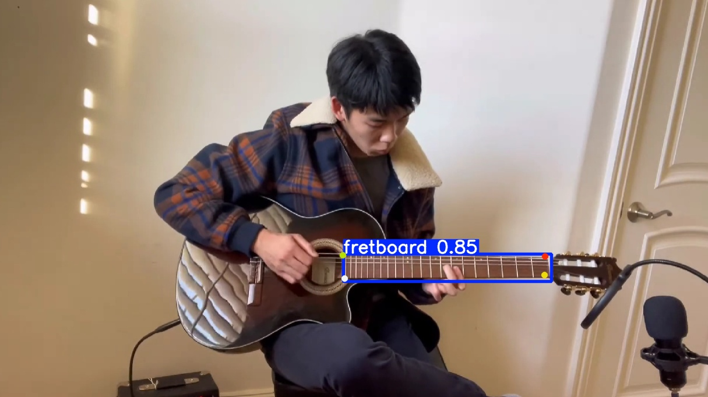

# Introduction

FretVision is a work-in-progress computer vision project that uses a standard webcam to track a guitarist’s fretting hand and infer chord shapes in real time.

The system is vision-only and does not rely on audio input. It uses Python, OpenCV, and MediaPipe to detect hand landmarks, track finger positions, and map those positions onto a guitar fretboard.

The long-term goal of this project is to reliably identify guitar chords on acoustic, classical, or electric guitars using only visual information. Furthermore, adding interactive overlays onto the fretboard could potentially be explored. This repository currently focuses on achieving stable, low-latency hand landmark detection as a foundation for future stages such as finger state classification, fretboard mapping, and chord inference.

In the future, audio and visual information could be combined, enabling polyphonic audio discernment to fine-tune chord detection and improve accuracy.

# Installation
1. Install Python 3.11 (64-bit) from python.org
Make sure to check `“Add Python to PATH”` during installation.
Verify installation:
`py -3.11 --version`

2. Clone the repository 
cd into FretVision directory

3. Install dependencies:
	`py -3.11 -m pip install --upgrade pip`
	`py -3.11 -m pip install -r requirements.txt`

4. Verify installation:
`py -3.11 -c "import cv2, mediapipe, numpy; print(cv2.__version__, mediapipe.__version__, numpy.__version__)"`

5. Run the hand tracking demo:
`py src/hand_tracking.py`

`Note: If any version issues occur, ensure you are running w/ python3.11 explicitly:`
`py -3.11 src/hand_tracking.py`

A window should pop up utilizing your camera.
Press q to quit the program.

# Requirements
* Python 3.11 (64-bit)
* Webcam
* A 6 string acoustic/classical/electric guitar

## Dataset & Labeling
- Images were labeled using **Supervisely** & **CVAT**
- Export format: **YOLOv8 segmentation**
- Dataset used contains **one object per frame**. 

Dataset paths are defined in `data.yaml`.

## Training
Pose training is run via CLI.
Example: `yolo task=pose mode=train model=MODEL_PATH_HERE data=data.yaml epochs=50 imgsz=960 batch=8`

Training outputs are generated under `runs/pose/...` and are not committed.

## Inference (Single Image)
Run segmentation on a single image:

`yolo task=pose mode=predict model=MODEL_PATH_HERE source=data\frames\example.img conf=0.3 save=True show=True`

For batch inference, `source` may be a folder instead of a single image.

## Model Weights
Trained weights are stored in:
`models/`
  
# Notes
- Python 3.11 is required for MediaPipe stability on Windows.
- If multiple Python versions are installed, always use py -3.11 to avoid version mismatches or add Python 3.11 to your path.

- The model may output multiple detections for a single fretboard; this is handled via confidence filtering and post-processing.
- String & fret positions are inferred mathematically from the fretboard geometry rather than being explicitly labeled.

## Git Ignore
Training data, raw videos, YOLO runs, and caches are excluded by design.  
See `.gitignore` for details.

# Next steps
This repo is a WIP and so this readme will be updated accordingly.

**TO DO (rough list):**
* Calculate fret positions & overlay
* Detect fingers consistently on the fretboard (w/ mediapipe or custom detection)
* Map fingers to their corresponding fret and string
* Infer chords from finger positions
* Consider how to implement interval detection based off of root note (assuming lowest note is root, NO INVERSIONS!).